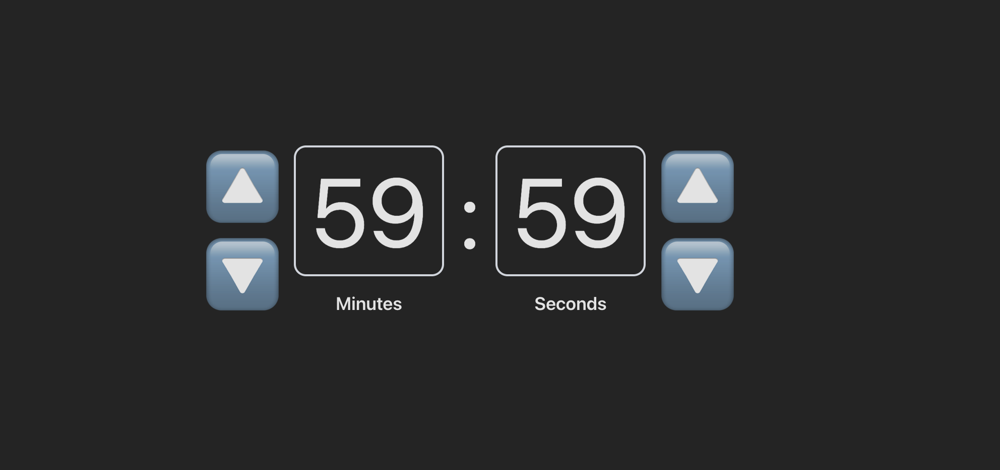

# 🔗 Timer

This is a mini-timer application built during a live coding session in 30 minutes. Interviwers were quite impressed with how quickly I designed the timer interface.




---

## 🚀 Getting Started

### 1. Clone the Repository

```bash
git clone https://github.com/iAyomi/Timer-task.git
cd Timer-task
```

---

### 2. Install Dependencies

```bash
yarn
```

---

### 3. Run the Development Server (Client)

```bash
yarn dev
```

---

## 💬 Contact

Have questions or found a bug?
[Open an issue](https://github.com/iAyomi/Timer-task.git) or ping me through smoke signals (just kidding, use [My Contact Page](https://iayomi.vercel.app/contact)).
